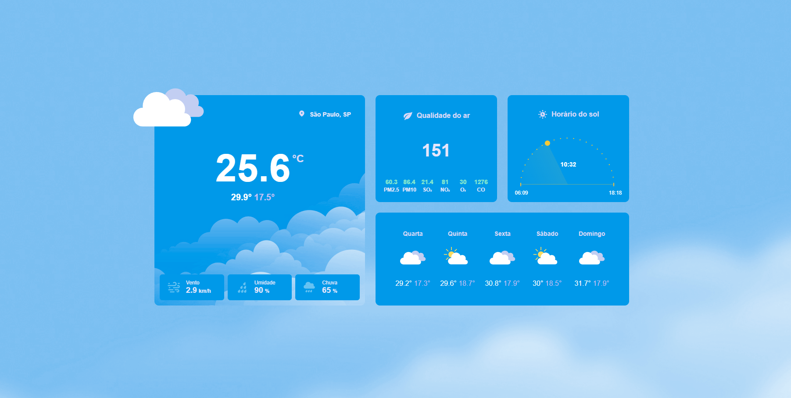
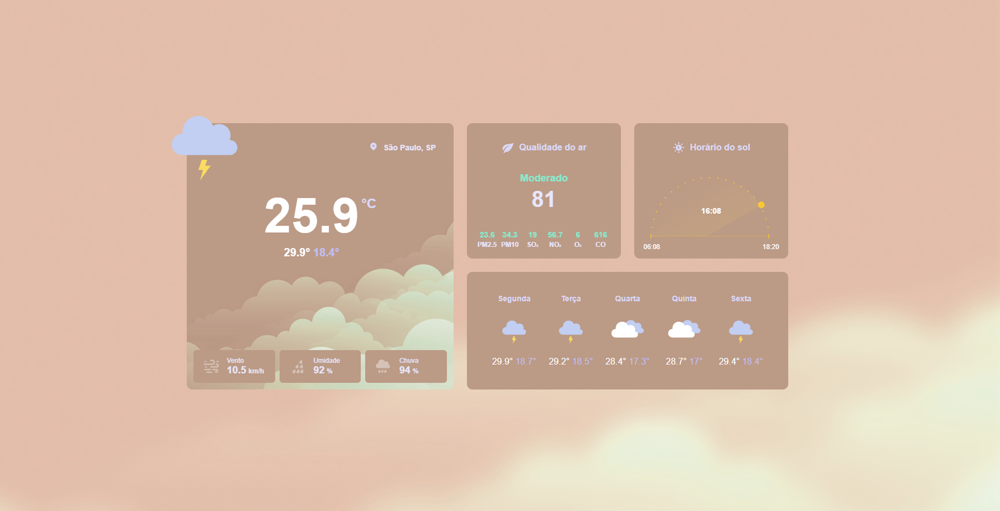
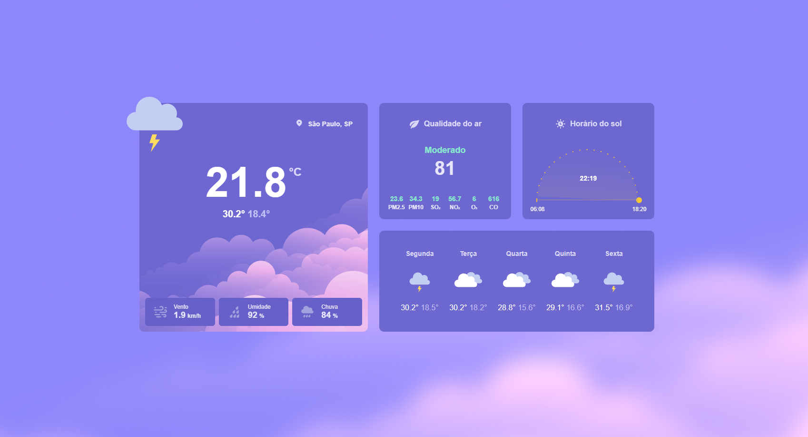

<h2 align="center">
  Catálogo em React
</h2>

<p align="center">
 <a href="#-sobre-o-projeto">Sobre</a> •
 <a href="#-tecnologias">Tecnologias</a> •
 <a href="#-aplicação">Aplicação</a> • 
 <a href="#-como-executar">Executar</a> 
</p>

## 💻 Sobre o projeto

Essa aplicação foi desenvolvida baseada no #BoraCodar da Rocketseat. Fora alguns ajustes responsivos, consumi duas APIs para alimentar o projeto, um em relação a previsão do tempo e outra da qualidade do ar. Além disso fiz um scriptizinho de Geolocalização onde o usuário pode permitir pegar a localização dele para retornar o clima naquela região. O app muda também a cor de acordo com o horário do dia.

---

## 🛠 Tecnologias

As seguintes ferramentas foram usadas na construção do projeto:

-   **React**
-   **Javascript**
-   **Css**
-   **Axios**

## 🚀 Aplicação

<p align="center">
  
</p>

<p align="center">
  
</p>

<p align="center">
  
</p>
---

## 🛠 COMO EXECUTAR

```

# Clone este repositório
$ git clone git@github.com:KaiqueBM/Clima-em-React.git

# Vá para a pasta do projeto
$ cd clima

# Instale as dependências
$ npm install

# Execute a aplicação em modo de desenvolvimento
$ npm run dev

# A aplicação será aberta na porta:5173 - acesse http://127.0.0.1:5173/

#Confira a aplicação no ar: https://clima-do-tempo.netlify.app/

```
